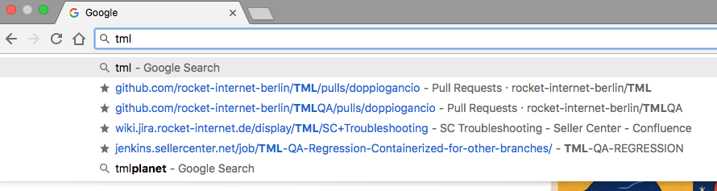
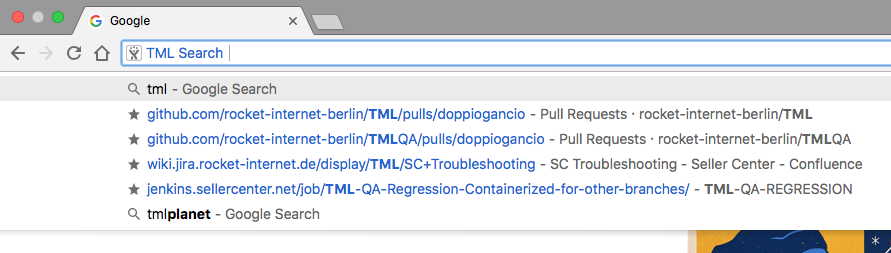
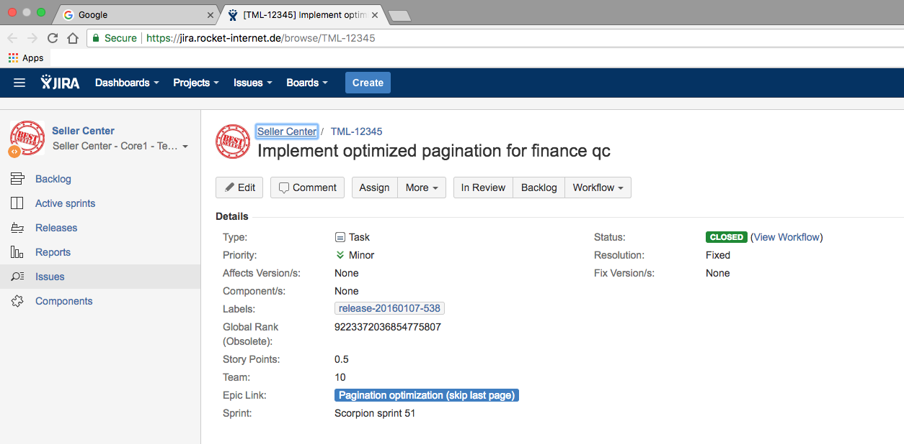

# Chrome Extension: TML Search
An omnibox keywork to go faster to a specific JIRA Issue page

## Setup
* Clone the project locally
* Open "Google Chrome" settings menu > More Tools > Extensions
* Click on "Load unpacked" button and specify the folder of the just cloned extension

## Example
Type in the address bar of Google Chrome "tml"

...and then press the TAB button.

...now press enter to go to the JIRA Issue page

